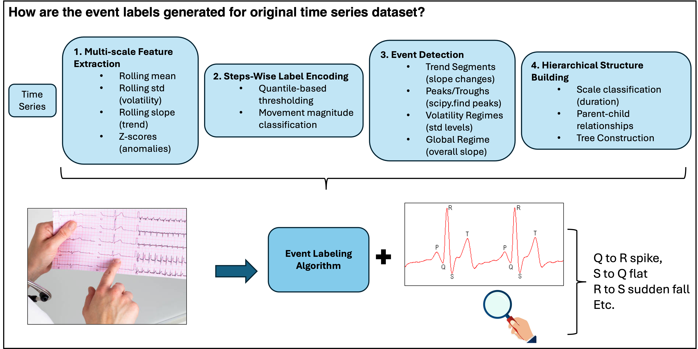

# Hierarchical Time Series Event Labeling System

A comprehensive system for detecting, classifying, and organizing time series events into hierarchical structures suitable for language model training.

## 🎯 Overview

This system transforms raw time series data into rich, hierarchical event annotations that can be used to train language models to understand and describe temporal patterns.

### Key Features

- **Multi-scale Analysis**: Extracts features at 5-50 timestep windows
- **Hierarchical Structure**: Organizes events from micro (single points) to global (full sequence)
- **Rich Vocabulary**: 64 distinct event labels across 7 categories
- **Multiple Text Formats**: Generate training text in various formats
- **Efficient Processing**: Vectorized operations using PyTorch
- **Extensible Design**: Easy to add new detectors and event types

## 📊 Hierarchical Event Structure

```
EventScale.GLOBAL (150+ steps)
    └── Overall sequence regime (bullish/bearish/sideways/volatile)
    
EventScale.MACRO (50-150 steps)
    └── Major trend segments, long volatility regimes
    
EventScale.MESO (15-50 steps)
    └── Medium trends, local corrections
    
EventScale.MINI (5-15 steps)
    └── Short segments, volatility clusters
    
EventScale.MICRO (1-5 steps)
    └── Spikes, single peaks/troughs
```

### Example Hierarchy

```
[0-335] SIDEWAYS_REGIME (GLOBAL)
  ├─ [0-120] UPTREND_LONG (MACRO)
  │   ├─ [30-45] DOWNTREND_SHORT (MESO) ← Nested correction
  │   │   └─ [38] SPIKE_DOWN (MICRO)
  │   └─ [50-55] VOLATILITY_SPIKE (MINI)
  ├─ [121-200] FLAT_SEGMENT (MACRO)
  └─ [201-335] DOWNTREND_LONG (MACRO)
      └─ [250] LOCAL_PEAK (MICRO)
```

## 🚀 Quick Start

```python
import torch
from hierarchical_event_labeling import HierarchicalEventDataset

# 1. Prepare your data [batch_size, sequence_length]
x = torch.randn(100, 336)  # 100 sequences, 336 timesteps each

# 2. Create dataset (this does all processing)
dataset = HierarchicalEventDataset(x, verbose=True)

# 3. Get annotation for first sequence
ann = dataset[0]

# 4. View hierarchical structure
ann.print_hierarchy()

# 5. Generate training text
text = ann.to_text(format='depth_marked')
print(text)
```

## 📖 Event Vocabulary

### Categories (64 labels total)

1. **Step Movements** (10 labels)
   - `FLAT`, `UP_SMALL`, `UP_MEDIUM`, `UP_LARGE`
   - `DOWN_SMALL`, `DOWN_MEDIUM`, `DOWN_LARGE`
   - `SPIKE_UP`, `SPIKE_DOWN`

2. **Trend Segments** (7 labels)
   - `UPTREND_SHORT`, `UPTREND_MEDIUM`, `UPTREND_LONG`
   - `DOWNTREND_SHORT`, `DOWNTREND_MEDIUM`, `DOWNTREND_LONG`
   - `FLAT_SEGMENT`

3. **Peaks & Troughs** (4 labels)
   - `LOCAL_PEAK`, `SHARP_PEAK`
   - `LOCAL_TROUGH`, `SHARP_TROUGH`

4. **Volatility Regimes** (4 labels)
   - `LOW_VOLATILITY`, `NORMAL_VOLATILITY`
   - `HIGH_VOLATILITY`, `VOLATILITY_SPIKE`

5. **Change Points** (2 labels)
   - `MEAN_SHIFT_UP`, `MEAN_SHIFT_DOWN`

6. **Global Regimes** (4 labels)
   - `BULLISH_REGIME`, `BEARISH_REGIME`
   - `SIDEWAYS_REGIME`, `VOLATILE_REGIME`

## 🔧 System Architecture

### Processing Pipeline

<div align="center">

</div>

### Core Components

1. **MultiScaleFeatureExtractor**
   - Efficient convolution-based feature extraction
   - Multiple temporal window sizes
   - Fully vectorized (batch processing)

2. **StepWiseEncoder**
   - Adaptive quantile thresholding
   - Step-by-step movement classification
   - Handles varying signal magnitudes

3. **Event Detectors**
   - `TrendSegmentDetector`: Slope-based segmentation
   - `PeakTroughDetector`: scipy.signal.find_peaks
   - `VolatilityRegimeDetector`: Rolling std quantiles

4. **HierarchicalEventBuilder**
   - Automatic scale classification
   - Containment-based parent finding
   - Depth-first tree construction

5. **HierarchicalAnnotation**
   - Complete sequence annotation
   - Multiple text format generation
   - Event filtering and querying

## 💾 Data Format

### Input
```python
x: torch.Tensor  # Shape: [B, L]
# B = batch size (number of sequences)
# L = sequence length (number of timesteps)
```

### Output Annotation
```python
annotation = dataset[0]

# Components:
annotation.sequence        # [L] Original time series
annotation.step_labels     # [L] Step-wise labels (vocab IDs)
annotation.event_roots     # List[HierarchicalEvent] - Root nodes
annotation.all_events      # List[HierarchicalEvent] - Flattened
```

### Event Structure
```python
event.start           # int: Starting timestep
event.end            # int: Ending timestep
event.label          # int: Vocabulary ID
event.label_name     # str: Human-readable name
event.scale          # EventScale: MICRO/MINI/MESO/MACRO/GLOBAL
event.event_type     # str: trend/peak/volatility/regime
event.confidence     # float: Detection confidence
event.metadata       # dict: Additional information
event.parent         # HierarchicalEvent or None
event.children       # List[HierarchicalEvent]
```

## 📝 Text Generation Formats

### 1. Depth-Marked (Token-Efficient)
```
[0-335]SIDEWAYS_REGIME >[0-120]UPTREND_LONG >>[30-45]DOWNTREND_SHORT >>>[38]SPIKE_DOWN
```
- Depth indicated by `>` symbols
- Compact representation
- ~150-300 tokens per sequence

### 2. Flat Sequential
```
[0-120]UPTREND_LONG [30-45]DOWNTREND_SHORT [38]SPIKE_DOWN [121-200]FLAT_SEGMENT
```
- Loses hierarchy information
- Simple sequential list
- ~100-200 tokens per sequence

### 3. Narrative (Natural Language)
```
Overall: sideways regime. 3 major segments detected. 
[0-120]: uptrend long (contains: trend, peak). 
[30-45]: downtrend short (within uptrend long [0-120]).
```
- Human-readable
- Includes context
- ~200-400 tokens per sequence

## 🔍 Usage Examples

### Basic Usage
```python
from hierarchical_event_labeling import HierarchicalEventDataset

# Load your data
x = torch.load('your_timeseries.pt')  # [B, L]

# Create dataset
dataset = HierarchicalEventDataset(x)

# Access annotations
for ann in dataset:
    print(ann.to_text())
```

### Filter Events
```python
# Get all macro-scale events
macro_events = ann.get_events_at_scale(EventScale.MACRO)

# Get events in time range
events = ann.get_events_in_range(100, 200)

# Filter by type
trends = [e for e in ann.all_events if e.event_type == 'trend']
peaks = [e for e in ann.all_events if e.event_type == 'peak']
```

### Generate Training Corpus
```python
from hierarchical_event_labeling import TextCorpusGenerator

# Generate text for all sequences
text_gen = TextCorpusGenerator()
corpus = text_gen.generate_corpus(dataset, format='depth_marked')

# Save to file
with open('training_corpus.txt', 'w') as f:
    for text in corpus:
        f.write(text + '\n')

# Get statistics
stats = text_gen.estimate_tokens(corpus)
print(f"Total tokens: {stats['total_tokens']:,}")
```

### Create PyTorch DataLoader
```python
from torch.utils.data import DataLoader

def collate_fn(batch):
    sequences = torch.stack([ann.sequence for ann in batch])
    texts = [ann.to_text() for ann in batch]
    return {'sequences': sequences, 'texts': texts}

dataloader = DataLoader(dataset, batch_size=32, collate_fn=collate_fn)

for batch in dataloader:
    # Train your model
    pass
```

## 📊 Performance

### Processing Speed
- **Feature Extraction**: ~1000 sequences/second (L=336)
- **Event Detection**: ~500 sequences/second
- **Hierarchy Building**: ~200 sequences/second
- **Overall**: ~100-200 sequences/second (end-to-end)

### Memory Usage
- **Raw Data**: ~4 bytes/value
- **Features**: ~40 bytes/timestep (10 features)
- **Events**: ~200 bytes/event
- **Total**: ~5-10 MB per 1000 sequences (L=336)

### Scalability
```python
# Small dataset
dataset = HierarchicalEventDataset(torch.randn(100, 336))  # ~1 second

# Medium dataset
dataset = HierarchicalEventDataset(torch.randn(10000, 336))  # ~1 minute

# Large dataset - process in batches
for batch in data_batches:
    partial = HierarchicalEventDataset(batch)
    # Save intermediate results
```

## 🎨 Customization

### Add Custom Event Detector
```python
class CustomDetector:
    def detect(self, x: torch.Tensor, features: Dict, idx: int) -> List[SimpleSegment]:
        # Your detection logic
        segments = []
        # ... detect events ...
        return segments

# Integrate into dataset
class CustomEventDataset(HierarchicalEventDataset):
    def __init__(self, x, **kwargs):
        super().__init__(x, **kwargs)
        self.custom_detector = CustomDetector()
    
    def _build_annotation(self, idx, L):
        # ... add custom events to builder ...
        pass
```

### Custom Text Format
```python
def custom_text_format(ann):
    parts = []
    
    # Add metadata
    parts.append(f"LEN:{len(ann.sequence)}")
    
    # Add events
    for event in ann.all_events:
        parts.append(f"{event.label_name}@{event.start}")
    
    return " | ".join(parts)
```

## 📈 Applications

1. **Time Series Foundation Models**
   - Pre-train on diverse time series data
   - Learn temporal pattern language

2. **EEG/ECG Signal Analysis**
   - Detect medical events
   - Hierarchical diagnosis

3. **Financial Data**
   - Market regime detection
   - Trading pattern recognition

4. **Sensor Networks**
   - Anomaly detection
   - System state monitoring

5. **Climate Data**
   - Weather pattern analysis
   - Long-term trend identification

## 🔬 Technical Details

### Feature Extraction Windows
- **5 steps**: Micro-patterns, noise filtering
- **10 steps**: Local trends, short volatility
- **20 steps**: Medium trends, regime detection
- **50 steps**: Major trends, global patterns

### Event Scale Classification
```python
duration = end - start + 1

if duration <= 5:      scale = MICRO
elif duration <= 15:   scale = MINI
elif duration <= 50:   scale = MESO
elif duration <= 150:  scale = MACRO
else:                  scale = GLOBAL
```

### Hierarchy Construction Algorithm
1. Sort events by scale (largest first)
2. For each event, find smallest containing event as parent
3. Build tree structure (parent-child links)
4. Sort children by start position

## 📄 License

MIT License - see LICENSE file

## 🤝 Contributing

Contributions welcome! Areas for improvement:
- Additional event detectors (seasonality, cycles)
- More sophisticated hierarchy algorithms
- Performance optimizations
- Additional text formats
- Support for multivariate time series

## 📧 Contact

For questions or issues, please open a GitHub issue or contact [e240203@e.ntu.edu.sg].

---

**Version**: 1.0.0  
**Last Updated**: December 2024  
**Python**: 3.8+  
**Dependencies**: PyTorch, NumPy, SciPy